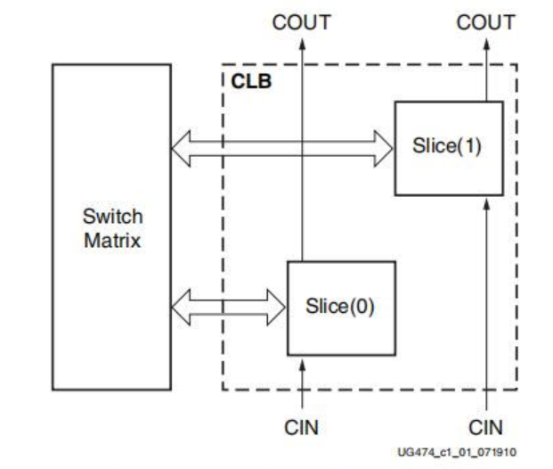
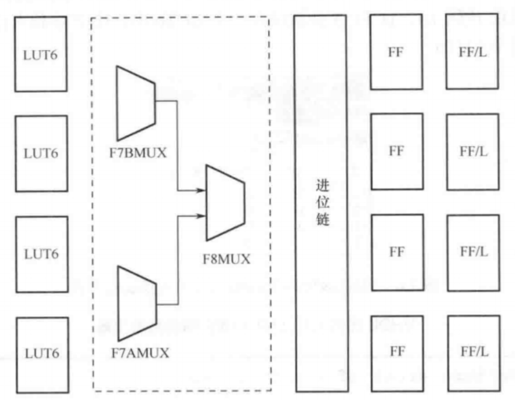

# 可配置逻辑块 Configurable Logic Block
## CLB
### 组成 
每个CLB可以被划分成两个Slice，并引出逻辑连线至开关矩阵（Switch Matrix，作为布线资源），同时还包含着算术进位逻辑的功能（CIN,COUT，进位输入和输出）。

因为Slice可分为SliceL(Logic)和 SliceM(Memory),所以CLB可分为CLBM和CLBM。
SliceL和SliceM都包含4个6输入查找表（LUT6）、3个数据选择器（MUX）、1个进位链（Carry Chain）和8个触发器（Flip-Flop）。

SLICEM内部的LUT可以读也可以写，可以实现移位寄存器和64bit的DRAM等存储功能，还可以实现基本的查找表逻辑。SLICEL内部的LUT只可以读，只能实现基本的查找表逻辑。
### 官方推荐的设计流程
1. CLB中的触发器有一个置位（set）和一个复位(reset),设计者禁止同时使用这两者。

2. 硬件中有着大量的触发器，所以推荐使用流水线的方式来提高效率。

3. 控制类输入信号在一个slice或者CLB中是被共享的，所以设计中的唯一控制类输入信号的数量应该减少。控制类输入信号包括时钟信号，时钟使能信号，使能信号，置位/复位信号。

4. 6输入LUT可以被设计成32位移位寄存器来提高布线效率。

5. 6输入LUT 可以被设计成64*1的DRAM来完成小规模存储需求。

6. 专用进位逻辑有效地实现了算术函数。
