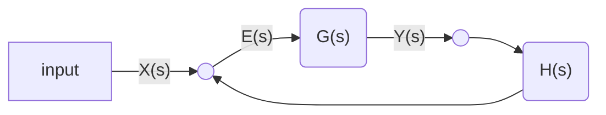

# 控制系统的数学模型
## 模型分类
1. 白箱模型
	1. 微分方程
	2. 传递函数
	3. 系统框图
	4. 信号流图
2. 黑箱模型
3. 灰箱模型

==状态空间模型可以完整描述内部变量==
==第一性原理(first-principle):基于原理建模==。机理建模只适用于简单的模型。
## 基于机理的建模（白箱模型）
### 微分方程
#### 步骤
1. 确定输入输出
2. 第一性原理写出微分方程
3. 消去中间变量
#### 迟滞（lag）
1. 能观性指数
2. 能控性指数
==lag可以加入到微分方程中==

### 传递函数
#### 微分方程的缺点：
1. 结构一变方程就需要变化
2. 复杂方程解不出来
==通过频域分析的传递函数模型解决这些问题==
#### 拉普拉斯变换
- 常见变换

| 原函数|拉普拉斯变换|
| --- | --- |
| $1$ | $\frac{1}{s}$|
| $t^n$ | $\frac{n!}{s^{n+1}}$|
| $e^{at}$ | $\frac{1}{s-a}$|
| $sin(at)$ | $ \frac{a}{s^2+a^2} $|
| $cos(at)$ | $\frac{s}{s^2+a^2}$|
| $f\prime(t)$ |$sF(s)-f(s)$|
|$f\prime \prime(t)$|$s^2F(s)-sf(0)-f(0)$|

- 常用定理
1. 初值定理
$$
f(0)=\lim_{s\rightarrow\infty}sF(s)
$$
2. 终值定理
$$
f(\infty) = \lim_{s\rightarrow0}sF(s)
$$

3. 位移定理（迟滞）
$$
L[f(t-\tau)] = e^{-\tau s}F(s)
$$

#### 传递函数模型

真传递函数(puper)
物理可实现的，传递函数的分母阶数大于分子阶数

==传递函数只能描述系统的可控部分，不可控部分无法描述，从而系统有多种实现==

==传递函数只用于线性时不变系统==:question:

### 方框图

### 信号流图
#### 梅森公式(Mason)
- 节点(Node)
  1. input node
  2. output node
  3. mixed node
- 分支(Branch)
- Transmission
- Path
  1. open path（起点和终点也不能重复）
  2. closed path（loop）
  3. forward path
  4. simple path(只有起点和终点的node可以重复)

$$
P=\frac{1}{\Delta}\sum p_k\Delta_k
$$
其中，信号流的特征方程$\Delta$定义为
$$\Delta = 1-\sum_{a}L_a+\sum_{b,c}L_bL_c-\sum_{d,e,f}L_dL_eL_f+...$$
$L_a$是所有的环增益，$L_bL_c$是两两不相交的环...
$P_k$是第$k$条前馈通道的增益,$\Delta_k$是第$k$条前馈通道特征方程的余因子（cofactor）

